# Street Cart

## Project Overview
Street Cart is a location-based hyperlocal e-commerce platform designed to connect local shops and customers. The project is built using Flutter and Dart, serving as a unified codebase for multiple platforms.

The ecosystem comprises three main applications: a Customer mobile app, a Shop Owner / Business Partner mobile app, and an Admin web panel. This allows local businesses to manage their inventory and orders, customers to discover products in their immediate vicinity, and administrators to monitor and manage the entire platform.

## Important Features

### Customer App
* **Authentication:** Safe authentication options, including email/password signup/login and Google Sign-In.
* **Onboarding & Splash:** Simple user onboarding slides and splash screen.
* **Location Setup:** Geolocation permissions to enable location-based product discovery.
* **Product Discovery:** Localized product listings based on proximity, with filtering options and detailed product screens.
* **Cart & Checkout:** Convenient shopping cart management and checkout options.
* **Payments:** Support for UPI payments and Cash on Delivery (COD).
* **Order Management:** Real-time order tracking and history.
* **Profile Management:** User profile and setting controls.

### Street Cart Business Partner
* **Authentication:** Shop partner registration, login, and application review.
* **Dashboard:** Metrics and overview of active orders and shop performance.
* **Product Management:** Complete CRUD operations for products, categories, and product images.
* **Order Processing:** Order tracking, acceptance, and status updates (e.g., preparing, ready for pickup, out for delivery).
* **Delivery Settings:** Configuration for delivery radius and custom delivery parameters.
* **Profile Management:** Edit business details and shop locations.

### Admin Web Panel
* **Authentication:** Secure administrative login.
* **Dashboard:** Unified oversight of system metrics, active users, shops, and total orders.
* **Shop Management:** Review, approve, or reject new shop registrations.
* **User Management:** Management of customer accounts and shop owners.
* **Order Monitoring:** Platform-wide order tracking.
* **Reports:** Visual insights and historical reports.
* **Settings:** Control category definitions and platform-wide configurations.

## Tech Stack
* **Framework:** Flutter (Dart)
* **State Management:** BLoC (Business Logic Component)
* **Dependency Injection:** GetIt (Service Locator)
* **Authentication:** Firebase Authentication, Google Sign-In
* **Database:** Cloud Firestore
* **Notification:** Firebase Cloud Messaging (FCM)
* **Image/media Storage:** Cloudinary
* **Navigation:** GoRouter(Admin)
* **Payments:** Razorpay Gateway test mode

## Project Structure
The code is structured as follows under the `lib` directory:
* **`lib/apps/`**: Entry configurations and setup for the different platform modules:
  * `customer_app/`: Application setup for the Customer app.
  * `shop_app/`: Application setup for the Shop app.
  * `admin_app/`: Setup for the Admin Web panel.
* **`lib/core/`**: Core utilities, constants, animations, theme configurations, navigation logic, and basic configurations used across the app modules.
* **`lib/di/`**: Service locator initialization using `GetIt` for dependency injection (`dependency_injection.dart`).
* **`lib/features/`**: Feature modules containing sub-modules divided into Clean Architecture layers:
  * `customer/`: Features specific to the customer experience.
  * `shop/`: Features and widgets for the shop owner.
  * `admin/`: Features for the admin console.
* **`lib/shared/`**: Reusable custom components and widgets shared across multiple features.
* **Main entry points**:
  * `lib/main.dart`
  * `lib/customer_main.dart`
  * `lib/shop_main.dart`
  * `lib/admin_main.dart`

## App Architecture
Street Cart is built following clean architecture principles:
* **State Management:** Uses BLoC (Cubit & Bloc classes) to maintain a separation between business logic and UI presentation.
* **Dependency Injection:** Powered by `GetIt` to locate and manage services, repositories, and BLoCs.
* **Backend Services:** `Firebase Auth` manages users and credentials, while `Cloud Firestore` stores application data in real-time.
* **Media Handling:** `Cloudinary` is used to host and serve shop and product images efficiently.

## Screenshots
*Screenshots showing key screens from the Street Cart applications.*

### Customer App
*Home* | *Products* | *Product Details*
:---:|:---:|:---:
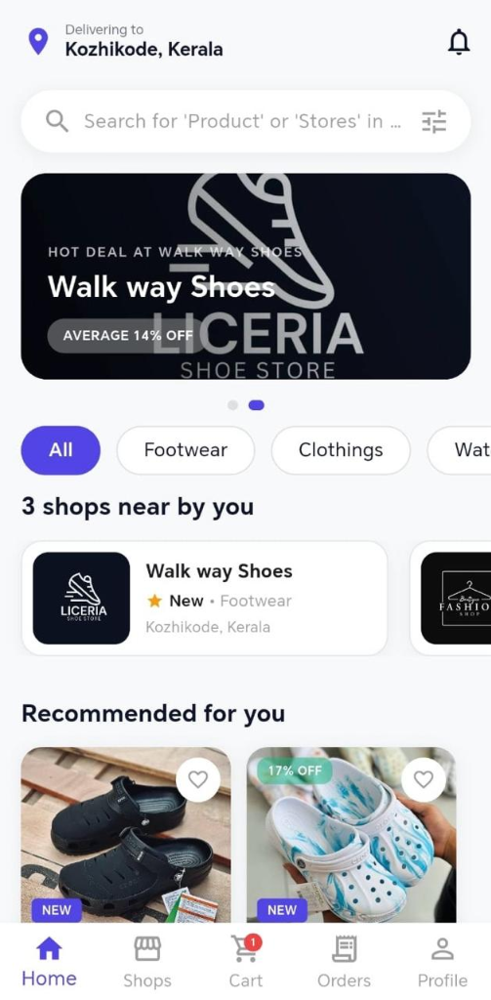 | 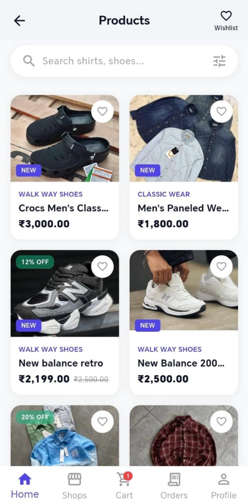 | 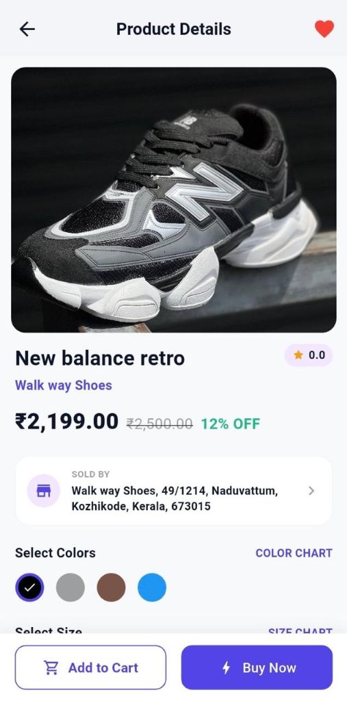

*Cart* | *Checkout* | *Order Details*
:---:|:---:|:---:
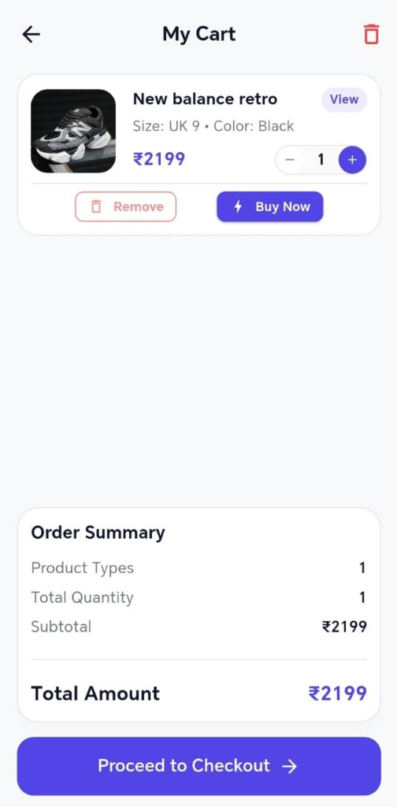 | 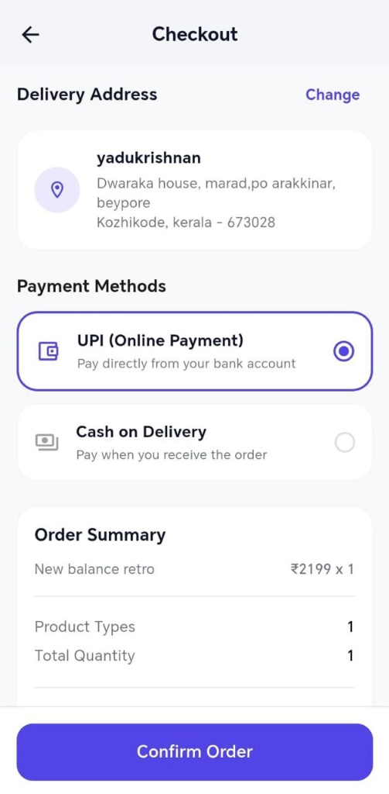 | 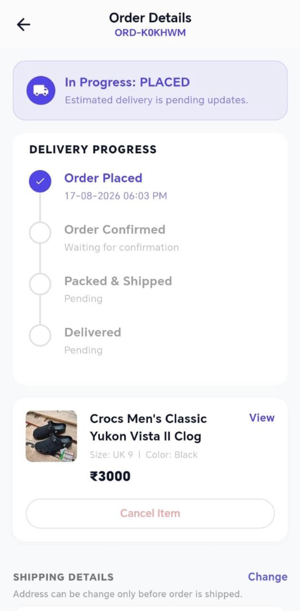

*Settings*
:---:
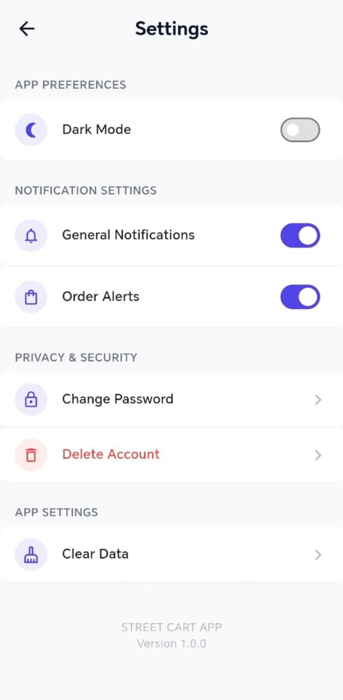


### Street Cart Business Partner
*Home* | *Products* | *Product Details*
:---:|:---:|:---:
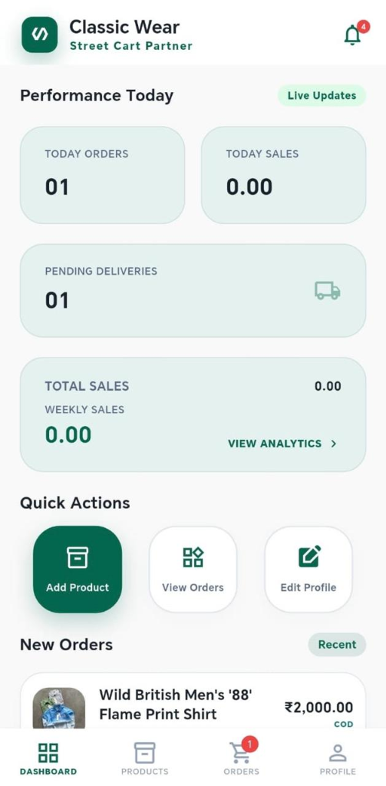 | 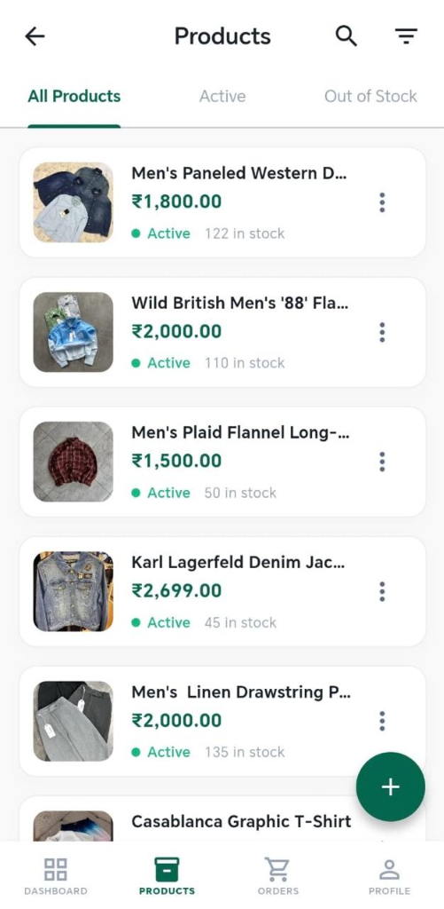 | 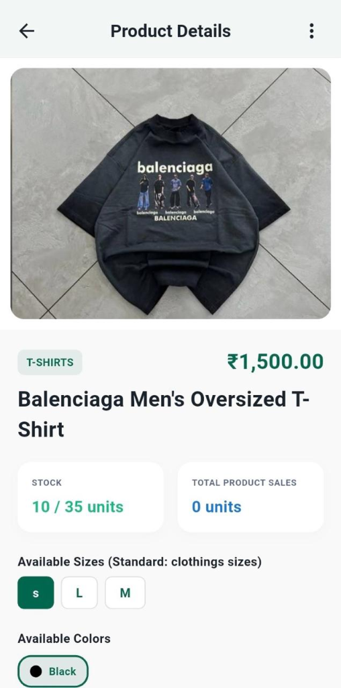

*Orders* | *Order Details* | *Sales Analytics*
:---:|:---:|:---:
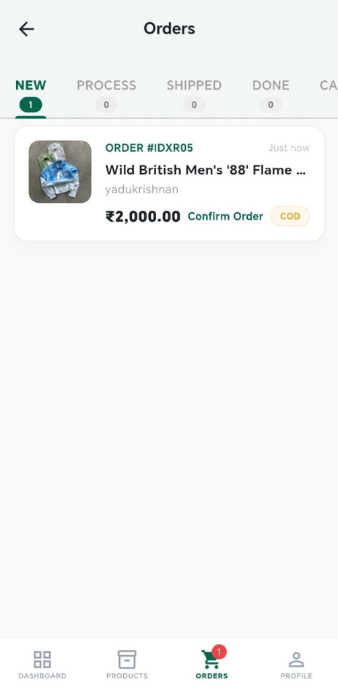 | 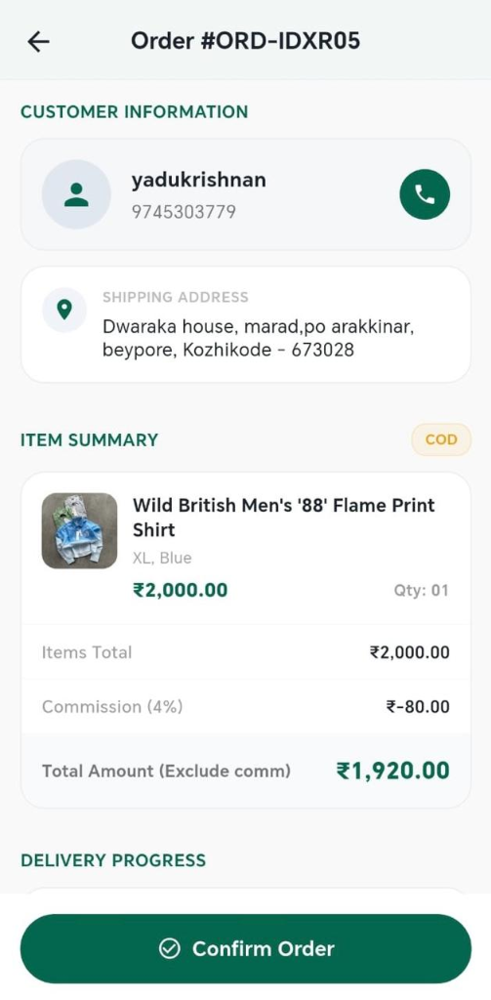 | 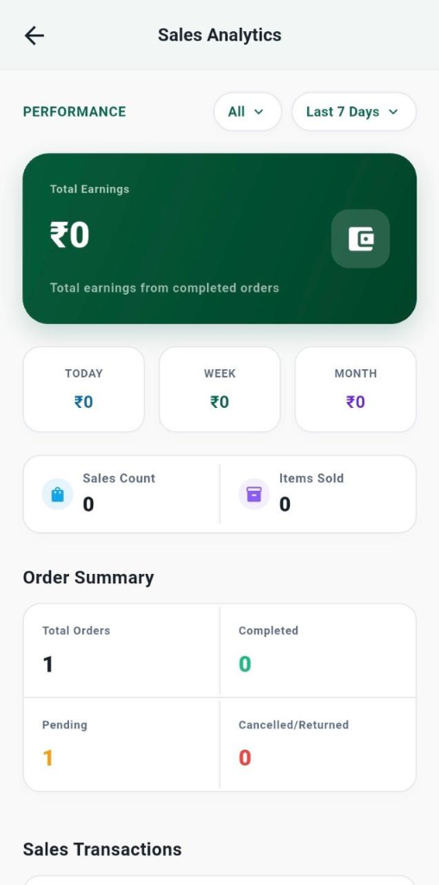

*Settings*
:---:
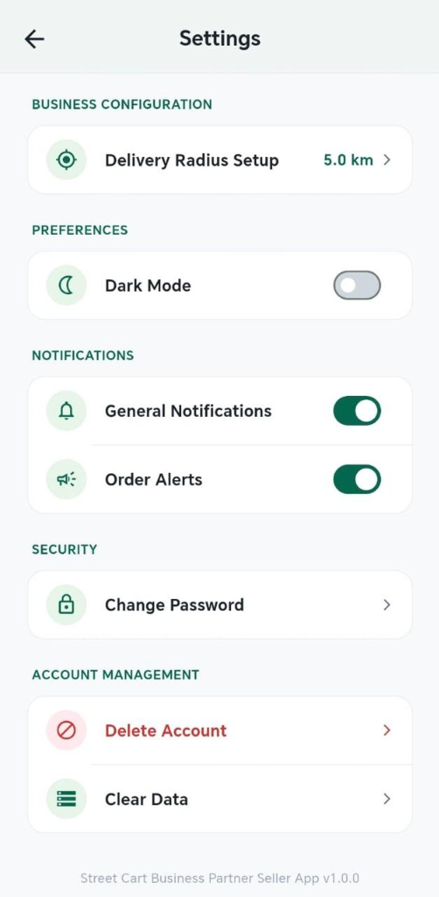


### Admin Web Panel
*Dashboard* | *Revenue* | *Shops*
:---:|:---:|:---:
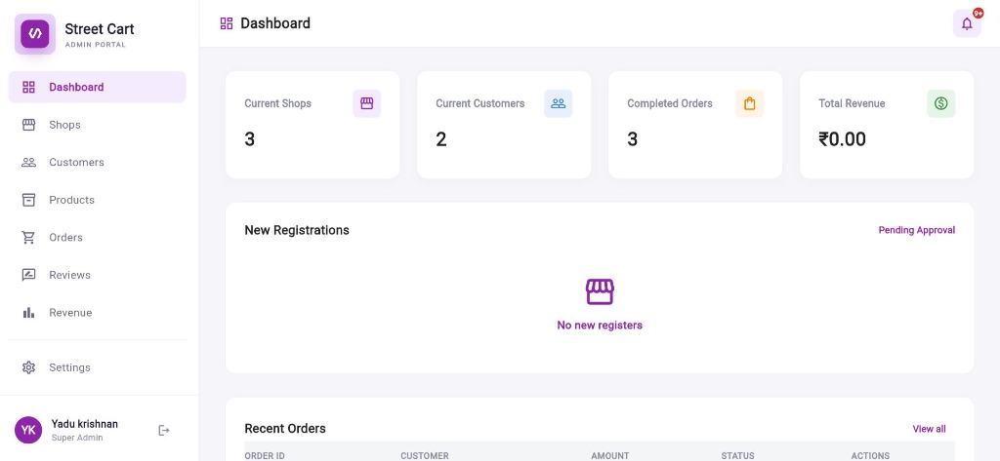 | 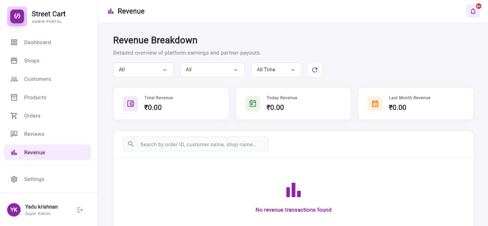 | 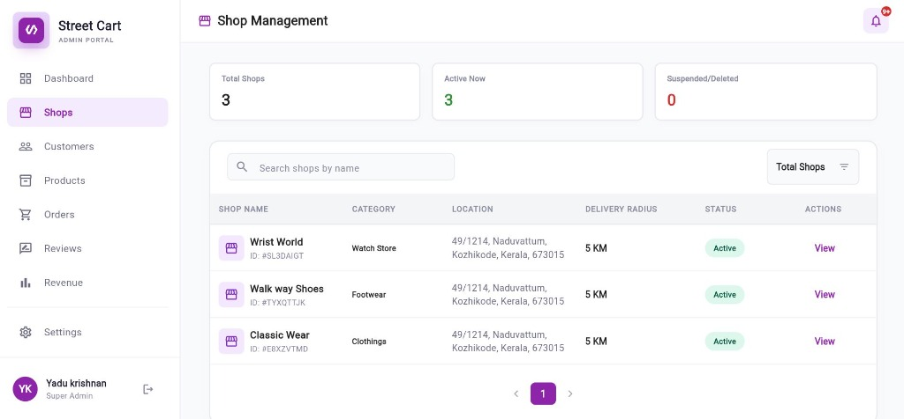

*Customers* | *Products* | *Orders* | *Settings*
:---:|:---:|:---:|:---:
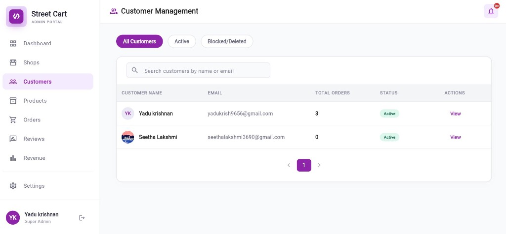 | 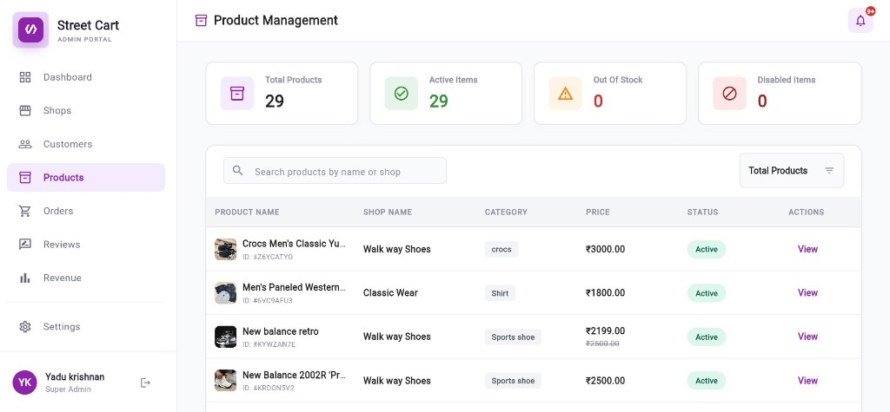 | 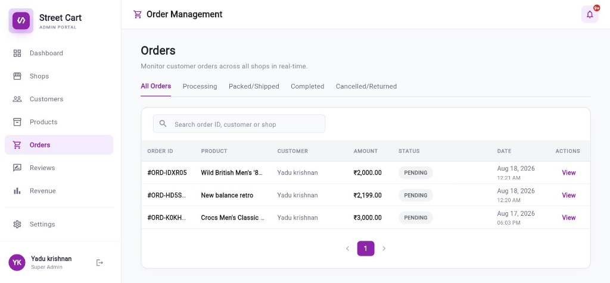 | 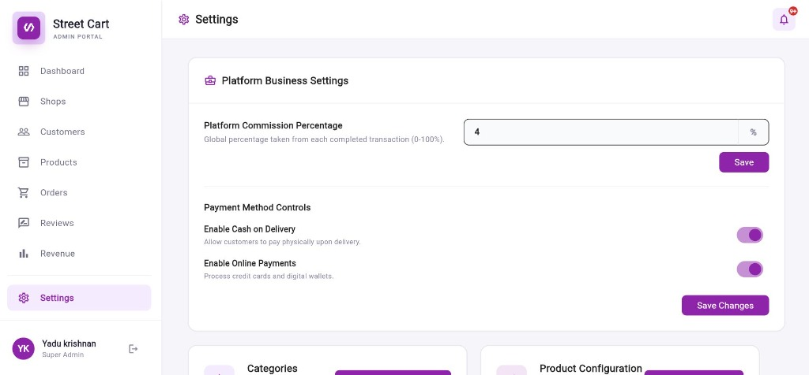


## Getting Started

### Prerequisites

Before running the project, make sure you have:

* Flutter SDK (compatible with the Dart version declared in `pubspec.yaml`)
* Dart SDK (included with Flutter)
* Android Studio and Android SDK
* Google Chrome (for Admin Web development)
* An active Firebase project configured for the application
* Git

### Local Setup
1. Clone the repository:
   ```bash
   git clone https://github.com/yadukrishnan369/street_cart.git
   cd street_cart
   ```
2. Install dependencies:
   ```bash
   flutter pub get
   ```
3. Set up the Firebase configuration:

   * Street Cart uses Firebase Authentication, Cloud Firestore, and Firebase Cloud Messaging.

For Android, configure the Firebase files for each application flavor:

- Customer App:
  `android/app/src/customer/google-services.json`

- Street Cart Business Partner:
  `android/app/src/shop/google-services.json`

For the Admin Web Panel, configure the required Firebase Web options for the web application.

Firebase configuration files may contain project-specific configuration. Do not commit private credentials, service account files, or other sensitive secrets to a public repository.


4. Run the project in development mode using one of the entry points:
   * **Customer App:**
     ```bash
     flutter run --flavor customer -t lib/customer_main.dart
     ```
   * **Shop App:**
     ```bash
     flutter run --flavor shop -t lib/shop_main.dart
     ```
   * **Admin Web Panel:**
     ```bash
     flutter run -d chrome -t lib/admin_main.dart --web-port=5000
     ```

## Build
To build release binaries, use the following commands with the appropriate flavors and entry points:

### Customer App APK
```bash
flutter build apk --release --flavor customer -t lib/customer_main.dart
```

### Shop App APK
```bash
flutter build apk --release --flavor shop -t lib/shop_main.dart
```

## Project Status
The Customer and Shop mobile applications currently have functional release builds. The codebase is fully configured, tested, and prepared for final distribution.

## Author
Yadukrishnan A
